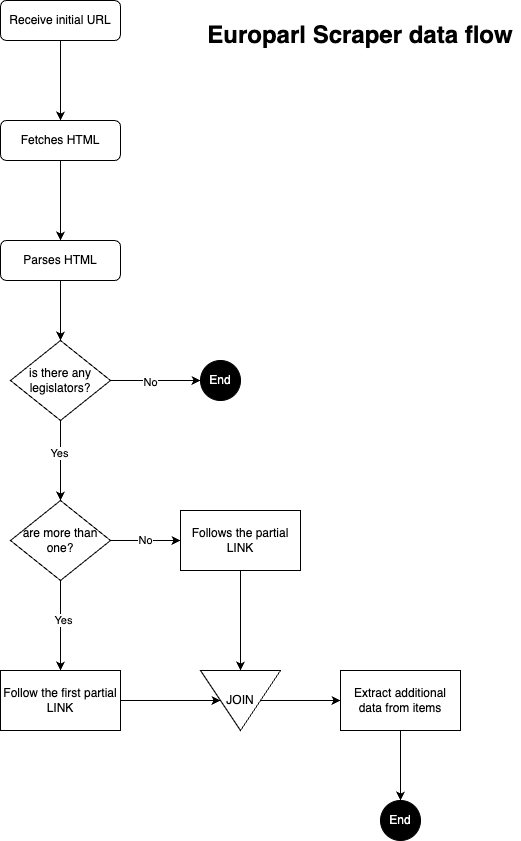

# European Parliament Scraper

This is a simple yet effective scraper built using `Node.js` to search for and retrieve information about European legislators from [https://www.europarl.europa.eu/meps/en/full-list/all](https://www.europarl.europa.eu/meps/en/full-list/all).

## Dependencies

- Node.js `16.13.0`

## Usage

Currently, it does not have a CLI (Command Line Interface) for utilizing its functionalities. However, you can programmatically import its interface and build your own scraper.

The `engine` module exports a `Scraper` function that accepts an object as a parameter. This object can contain the following attributes:
- `target` - The URL string you want to scrape.
- `tasks` - An array of objects where you define a kind of pipeline to act on the found legislators.
- `fetcher` (optional) - You can provide your own implementation of the Axios / Fetch function with your business logic as well.


## Data flow overview

.

## Internals

As mentioned above, this scraper use a species of pipeline to transform data as you wishes. This strategy was adpoted to avoid too custom code at the Engine core. The following code shows how it works at the Europarl website.

```javascript
/*
* After retrieving the HTML from the main page, the Engine builds a
* list containing all ~700 legislators. This is the data we have to work with.
*
* The `tasks` parameter accepts a list of objects with the interface
* {name: string, func: function, only?: number}.
*
* This object is used internally to apply the `func` to every legislator
* if the conditions apply.
*
* For instance, {name: 'parse', func: (e) => e, only: 10} will be applied
* only to the element at index 10.
*
*
* You must remember that after the Engine builds the list of legislators, you will
* get a list of Cheerio.AnyNode. That's why the first task is used to
* reload these nodes as CheerioAPI objects.
*
* The second task, as its name suggests, will follow a URL but only
* for the element at index 0.
*/
export const tasks = [
  {
    name: 'parse',
    func: (item) => {
      const $ = cheerio.load({ content: item, isDocument: false })
      return legislator($(item))
    }
  },
  { name: 'follow_url', func: followUrl, only: 0 }
]
```

With the above JS comment we have introduced the way of transform our legislator data until we get the desired output.
